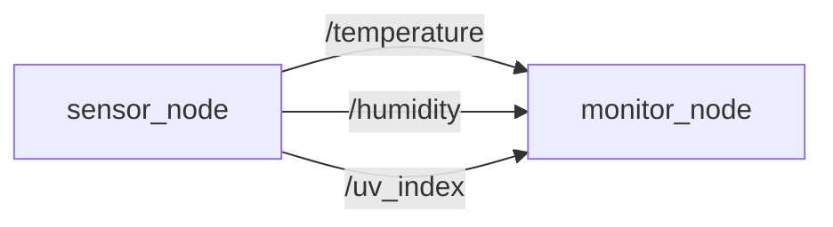
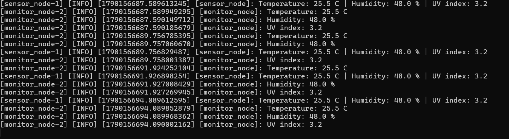

# ROS 2 Temperature Monitor

## A projekt célja

A projekt egy egyszerű ROS 2 alapú monitorozó rendszer, amely egy szenzorokat szimuláló node segítségével hőmérsékletet, páratartalmat és UV-indexet publikál, majd egy másik node ezeket az adatokat fogadja és kiírja.

A projekt oktatási célú, ezért az értékek szimulált adatok, nem valódi fizikai szenzorokból származnak.

## Használt környezet

* Ubuntu 22.04
* ROS 2 Humble
* C++
* `rclcpp`
* `std_msgs`
* CMake
* Git / GitHub

## Projekt felépítése

A projekt egy ROS 2 workspace-ben található, és egy package-et tartalmaz.

```text
ros2_ws/
└── src/
    └── temperature_monitor/
        ├── src/
        │   ├── sensor_node.cpp
        │   └── monitor_node.cpp
        ├── CMakeLists.txt
        └── package.xml
```

## Node-ok

### `sensor_node`

A `sensor_node` szimulált szenzoradatokat állít elő.

Három topicra publikál:

* `/temperature` – hőmérséklet
* `/humidity` – páratartalom
* `/uv_index` – UV-index

Az adatok 2 másodpercenként kerülnek publikálásra.

A jelenlegi tesztértékek:

* Hőmérséklet: `25.5 °C`
* Páratartalom: `48.0 %`
* UV-index: `3.2`

### `monitor_node`

A `monitor_node` mindhárom topicra feliratkozik, és a kapott adatokat kiírja a terminálba.

## Node–topic kapcsolatok



A rendszerben tehát:

* 1 package
* 2 node
* 3 publisher
* 3 subscriber
* 3 topic

## Fordítás

A ROS 2 környezet betöltése után a package a következő paranccsal fordítható:

```bash
cd ~/ros2_ws
source /opt/ros/humble/setup.bash
colcon build --packages-select temperature_monitor
```

Sikeres fordítás esetén:

```text
Finished <<< temperature_monitor
Summary: 1 package finished
``

## Futtatás

A lefordított package használatához:

```bash
source ~/ros2_ws/install/setup.bash
```

### `sensor_node` indítása

```bash
ros2 run temperature_monitor sensor_node
```

A terminálban például:

```text
Temperature: 25.5 C | Humidity: 48.0 % | UV index: 3.2
```

### `monitor_node` indítása

Egy másik terminálban:

```bash
source /opt/ros/humble/setup.bash
source ~/ros2_ws/install/setup.bash
ros2 run temperature_monitor monitor_node
```

A node a kapott adatokat külön-külön kiírja:

```text
Temperature: 25.5 C
Humidity: 48.0 %
UV index: 3.2
```

## Indítás launch fájllal

A két node egyszerre is elindítható a launch fájl segítségével:

```bash
ros2 launch temperature_monitor temperature_monitor.launch.py
```

### Launch futás közben



## Topicok ellenőrzése

Az elérhető topicok megtekintése:

```bash
ros2 topic list
```

Az egyes topicok adatainak ellenőrzése:

```bash
ros2 topic echo /temperature
ros2 topic echo /humidity
ros2 topic echo /uv_index
```

Egy topic kapcsolatainak ellenőrzése:

```bash
ros2 topic info /temperature
```

A teszt során a `/temperature` topic esetében 1 publisher és 1 subscriber volt látható.

## Git verziókövetés

A projekt fejlesztése több commitban történt.

### 1. commit

```text
Create basic temperature publisher and subscriber
```

Ebben az alap hőmérséklet-publikáló és -figyelő rendszer készült el.

### 2. commit

```text
Add humidity and UV index monitoring
```

Ebben a verzióban a rendszer páratartalommal és UV-indexszel bővült.

## Összefoglalás

A projekt egy egyszerű ROS 2 publisher–subscriber kommunikációt mutat be. A `sensor_node` három különböző adatot publikál, a `monitor_node` pedig ezeket a megfelelő topicokról fogadja.

A rendszer sikeresen lefordítható és futtatható ROS 2 Humble környezetben.

##Készítette
Kristóf Ákos - AEXBRW
